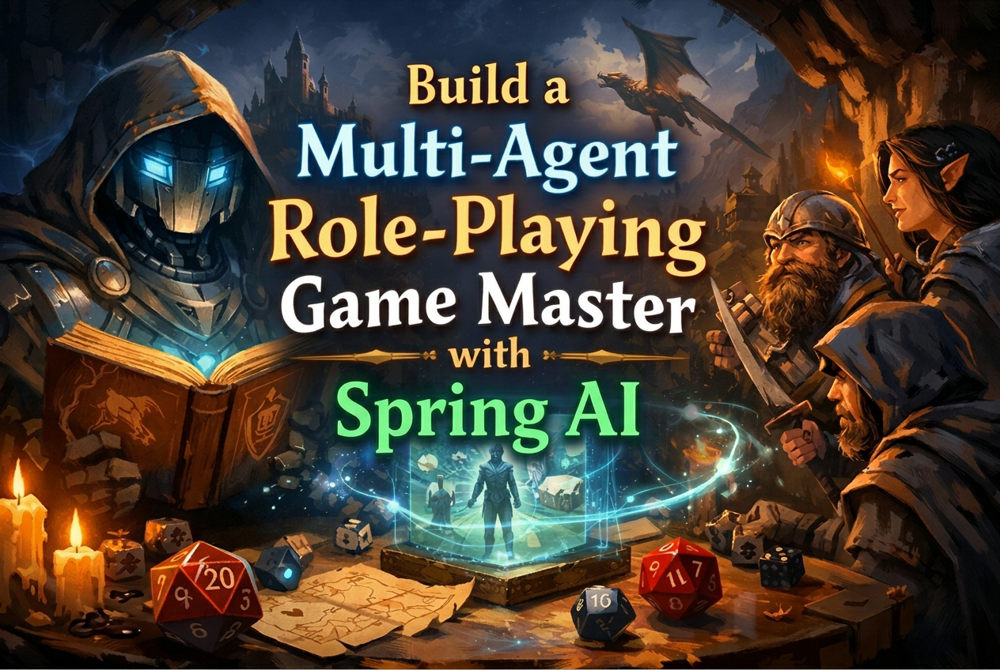

# Once Upon Spring AI: A Developer's Epic Journey into Agentic Java



_"Roll for Initiative... in Java!"_

# ---> [LINK TO THE AWS WORKSHOP](https://catalog.us-east-1.prod.workshops.aws/workshops/a49bf534-72f6-4571-bf77-ed201854284a)

Welcome, brave adventurer, to the ultimate Spring AI quest! This comprehensive workshop will transform you from a coding apprentice into a master of AI agent orchestration using **Java 25** and **Spring AI**. Through five epic chapters, you'll learn to create, equip, and command digital companions that can think, act, and collaborate like a legendary adventuring party.

## 🌐 The Complete Adventure Map

Your journey through the realms of AI agents is carefully structured as a progressive quest. **Each chapter builds upon the previous one** - complete them in order to unlock the full power of Spring AI!

### 🧙‍♂️ [Chapter 1: The Art of Agent Summoning](chapter1/)
**Master the fundamental ritual of agent creation**
- Learn what Spring AI is and how it works
- Summon your first AI companion — a Dungeon Master chatbot
- Configure Amazon Bedrock models and system prompts
- Understand the core concepts of agent development

### ⚔️ [Chapter 2: AI Agent with Built-in Tools](chapter2/)
**Equip your agents with community-powered tools**
- Discover Spring AI community tools (`spring-ai-agent-utils`)
- Learn how agents autonomously choose and use tools
- Master web scraping and information gathering with `SmartWebFetchTool`
- Understand tool registration and the agentic loop

### 🔨 [Chapter 3: The Adventurer's Arsenal](chapter3/)
**Forge your own custom tools and enchantments**
- Transform Java methods into agent tools with `@Tool` and `@ToolParam`
- Create the legendary Dice of Destiny
- Master the `//SOURCES` directive for multi-file JBang projects
- Build domain-specific capabilities using Java 25 records

### 🌐 [Chapter 4: The Tavern Notice Board - MCP Integration](chapter4/)
**Expose tools as remote services through Model Context Protocol**
- Build and deploy an MCP server with Spring Boot and `@McpTool`
- Create an MCP client with an interactive REPL
- Understand distributed tool architectures over Streamable HTTP
- Master external service connections using `SyncMcpToolCallbackProvider`

### 🏰 [Chapter 5: The Council of Agents - A2A Mastery](chapter5/)
**Command multiple agents in perfect harmony**
- Build a complete multi-agent D&D system
- Master Agent-to-Agent (A2A) communication with `AgentCard` and `AgentExecutor`
- Orchestrate specialized agents (Rules, Character, Game Master) working together
- Combine A2A, MCP, and RAG in a single architecture

## 🎒 Preparing for Your Quest

### Essential Gear (Prerequisites)

Before embarking on this legendary adventure, ensure you have:

1. **JBang** (the enchanted build tool — no Maven or Gradle required!)
   ```bash
   # Install JBang
   curl -Ls https://sh.jbang.dev | bash -s - app setup

   # Verify
   jbang --version
   ```

2. **Java 25 using JBang** (your trusty spellcasting focus)
   ```bash
   # Install Java 25
   jbang jdk install 25

   # Set it as default
   jbang jdk default 25

   # Configure your shell to use it
   eval $(jbang jdk java-env)

   # Verify
   java -version   # Should show: openjdk version "25"
   ```

3. **AWS credentials** configured with **permissions to Amazon Bedrock**
   ```bash
   export AWS_ACCESS_KEY_ID=your-access-key
   export AWS_SECRET_ACCESS_KEY=your-secret-key
   export AWS_REGION=us-west-2
   ```
   You can use any model available in your Amazon Bedrock account — just update the model ID in each chapter's source file.

4. **A sense of adventure** and willingness to experiment! 🎲

### 🚀 Run Your First Chapter

```bash
cd chapter1
jbang DungeonMasterSimple.java
```

That's it. No Maven, no Gradle, no build files — just one Java file and you're adventuring!

## 🎯 How to Embark on Your Quest

### The Sacred Order of Learning

**⚠️ IMPORTANT**: Complete the chapters in order! Each builds upon the previous one's knowledge and skills.

1. **Progress through each chapter** - Don't skip ahead, each chapter introduces essential concepts
2. **Complete all TODOs** - Each chapter has guided exercises to master the concepts
3. **Test your creations** - Run your agents with `jbang` and see them come to life
4. **Experiment and explore** - Try variations and push the boundaries

### Workshop Structure

Each chapter follows the same magical pattern:

- 📜 **README Guide**: Complete instructions and background lore
- 🎯 **TODO Exercises**: Hands-on coding challenges to complete
- 🧪 **Testing Instructions**: How to verify your magical creations work
- 🏆 **Solution Reference**: Complete working examples in the solution branch

## 🧙‍♂️ What is Spring AI?

Spring AI is a powerful framework for creating AI-powered applications in Java - think of it as your spellbook for summoning digital companions that can interact with tools and services. Like a well-equipped adventuring party, Spring AI provides:

- 🎭 **Agent Creation**: Easy summoning via `ChatClient` — the gateway to AI conversations
- ⚔️ **Tool Integration**: Built-in `@Tool` / `@ToolParam` annotations and community tools
- 🔄 **Model Flexibility**: Support for multiple AI providers (Amazon Bedrock, OpenAI, Ollama, and more)
- 🌐 **External Connections**: Integration with services through MCP (Model Context Protocol)
- 🏰 **Multi-Agent Systems**: Coordinate multiple agents using A2A (Agent-to-Agent) protocol

### 📖 The Sacred Terminology

- 🤖 **ChatClient**: The central abstraction for interacting with an AI model in Spring AI
- 🔧 **@Tool**: Annotation that transforms a Java method into a callable AI function
- 📋 **System Prompt**: The character sheet defining your agent's personality and behavior
- 🧠 **ChatModel**: The bridge to the AI provider (Bedrock, OpenAI, etc.)
- 🌐 **MCP**: Model Context Protocol for connecting to external tool servers
- 🏰 **A2A**: Agent-to-Agent protocol for multi-agent communication
- 🎒 **JBang**: Build tool that runs `.java` files directly with embedded `//DEPS` metadata

## 🗂️ Project Structure

```
sample-once-upon-spring-ai/
├── README.md
├── chapter1/                          # 🧙‍♂️ The Art of Agent Summoning
│   └── DungeonMasterSimple.java
├── chapter2/                          # ⚔️ AI Agent with Built-in Tools
│   └── DungeonMasterWithBuiltInTools.java
├── chapter3/                          # 🔨 The Adventurer's Arsenal
│   ├── DiceTools.java
│   └── DungeonMasterWithCustomTools.java
├── chapter4/                          # 🌐 The Tavern Notice Board (MCP)
│   ├── DiceRollMcpServer.java
│   ├── DungeonMasterMCPClient.java
│   └── application.properties
└── chapter5/                          # 🏰 The Council of Agents (A2A)
    ├── agents/
    │   ├── rules/                     # D&D rules lookup agent
    │   ├── character/                 # Character management agent
    │   └── gamemaster/                # Orchestrator agent
    └── utils/
        └── CreateKnowledgeBase.java   # PDF to vector store ingestion
```

## ☁️ Amazon Bedrock Models

Participants must have **permissions to Amazon Bedrock** in their AWS account. You can use any model available in your Bedrock console — simply update the model ID in each chapter's source file to match your preferred model.

The workshop examples default to:

- 🎭 **Anthropic Claude** (via Bedrock) — All chapters
- 🧮 **Amazon Titan Embed Text V2** — Chapter 5 (vector store embeddings)

## 🎓 Learning Objectives

By completing this workshop, you'll master:

- ✅ **Agent Fundamentals**: Create, configure, and deploy AI agents with Spring AI and `ChatClient`
- ✅ **Tool Mastery**: Use community tools and create custom ones with `@Tool`
- ✅ **External Integration**: Connect agents to external services via MCP
- ✅ **Multi-Agent Systems**: Build distributed applications with A2A protocol
- ✅ **Modern Java**: Leverage Java 25 features — records, unnamed classes, text blocks, `var`, and JBang

---

## 📚 Additional Resources

### Official Documentation & Tools

- 📖 **[Spring AI Documentation](https://docs.spring.io/spring-ai/reference/)** - Complete reference and guides
- 📖 **[JBang Documentation](https://www.jbang.dev/documentation/jbang-all/latest/index.html)** - JBang user guide
- ☁️ **[Amazon Bedrock Documentation](https://docs.aws.amazon.com/bedrock/)** - Model access and setup

### Community & Protocols

- 🌐 **[A2A Protocol](https://a2a-protocol.org/latest/)** - Agent-to-Agent specification
- 🔌 **[Model Context Protocol](https://modelcontextprotocol.io/)** - MCP specification

---

## 🎲 The Adventure Never Ends...

Remember, the most epic adventures are the ones you create yourself. Whether you're building the next great AI application or just exploring the boundaries of what's possible, you now have the tools and knowledge to make it happen.

_May your agents be wise, your tools be sharp, and your code compile on the first try!_ 🎲✨

---

**"The best way to predict the future is to build the agents that will create it."** - Modern Developer Wisdom

_Happy coding, Agent Master!_ 🐉⚔️🧙‍♂️
