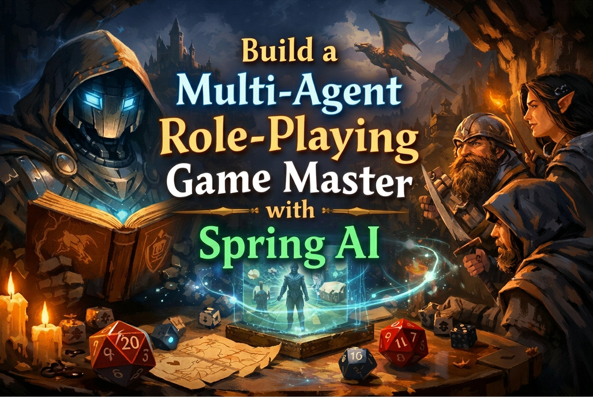

# Once Upon Spring AI: A Developer's Epic Journey into Agentic Java



_"Roll for Initiative... in Java!"_

> ✨ **You're on the `solution` branch.** Every `// TODO` from `main` is filled in here — JBang sources are the source of truth, and `chapter*-maven*/` mirrors are auto-generated from them. Use this branch to compare against your own attempts, or to run a finished example end-to-end. The workshop itself lives on [`main`](https://github.com/aws-samples/sample-once-upon-spring-ai/tree/main).

# ---> [LINK TO THE AWS WORKSHOP](https://catalog.us-east-1.prod.workshops.aws/workshops/a49bf534-72f6-4571-bf77-ed201854284a)

Welcome, brave adventurer, to the ultimate Spring AI quest! This comprehensive workshop will transform you from a coding apprentice into a master of AI agent orchestration using **Java 25** and **Spring AI**. Through five epic chapters, you'll learn to create, equip, and command digital companions that can think, act, and collaborate like a legendary adventuring party.

## 🌐 The Complete Adventure Map

Your journey through the realms of AI agents is carefully structured as a progressive quest. **Each chapter builds upon the previous one** - complete them in order to unlock the full power of Spring AI!

### 🧙‍♂️ [Chapter 1: The Art of Agent Summoning](chapter1/)
**Master the fundamental ritual of agent creation**
- Learn what Spring AI is and how it works
- Summon your first AI companion — a Game Master chatbot
- Configure Amazon Bedrock models and system prompts
- Understand the core concepts of agent development

### ⚔️ [Chapter 2: AI Agent with Built-in Tools](chapter2/)
**Equip your agents with community-powered tools**
- Discover Spring AI community tools (`spring-ai-agent-utils`)
- Learn how agents autonomously choose and use tools
- Master web scraping and information gathering with `SmartWebFetchTool`
- Understand tool registration and the agentic loop

### 🔨 [Chapter 3: The Adventurer's Arsenal](chapter3/)
**Forge your own custom tools and enchantments**
- Transform Java methods into agent tools with `@Tool` and `@ToolParam`
- Create the legendary Dice of Destiny
- Master the `//SOURCES` directive for multi-file JBang projects
- Build domain-specific capabilities using Java 25 records

### 🌐 [Chapter 4: The Tavern Notice Board - MCP Integration](chapter4/)
**Expose tools as remote services through Model Context Protocol**
- Build and deploy an MCP server with Spring Boot and `@McpTool`
- Create an MCP client with an interactive REPL
- Understand distributed tool architectures over Streamable HTTP
- Master external service connections using `SyncMcpToolCallbackProvider`

### 🏰 [Chapter 5: The Council of Agents - A2A Mastery](chapter5/)
**Command multiple agents in perfect harmony**
- Build a complete multi-agent TTRPG system with character inventory management
- Master Agent-to-Agent (A2A) communication with `AgentCard` and `AgentExecutor`
- Orchestrate specialized agents (Rules, Character, Game Master) working together
- Implement conversation memory with `MessageChatMemoryAdvisor`
- Combine A2A, MCP, and RAG in a single architecture

## 🗺️ Choose Your Path

Before you start, commit to **one** of the two paths below. Both are first-class — pick the one that fits how you want to work.

### 🧙 The JBang Path

**For:** Java developers curious to try a new way of running Java, and non-Java developers who want a minimal setup.

**Tooling:** JBang CLI + any text editor (VS Code, Sublime, nano — whatever you like).

**You'll run code like this:** `jbang GameMasterSimple.java`

**The contract:** Follow the workshop instructions exactly as written. If you deviate, you're on your own.

---

### ⚔️ The IntelliJ Path

**For:** Java developers who want to work the way they usually do.

**Tooling:** IntelliJ IDEA + Maven. **No JBang needed.**

**Prerequisite:** You already have **IntelliJ IDEA for Java** installed on your laptop (Community or Ultimate). This path does not cover installing the IDE.

**You'll run code like this:** open `chapter1-maven/` in IntelliJ, click the green arrow next to `main()` in `GameMasterSimple.java`.

**The contract:** Work the way you normally do. If your IntelliJ / Maven / JDK setup has quirks, you're on your own.

> ⚠️ **Pick one and stick to it.** Mixing paths (editing the JBang file while running the Maven project, or vice versa) is the fastest way to get confused.

## 🎒 Preparing for Your Quest

### Essential Gear (Prerequisites)

Before embarking on this legendary adventure, ensure you have:

1. **Java 25** as your trusty spellcasting focus.

#### 🧙 If you picked the JBang Path

**Install JBang**

[JBang](https://www.jbang.dev/) runs `.java` files directly with dependencies declared as `//DEPS` comments — no Maven, no Gradle, no `pom.xml`.

```bash
curl -Ls https://sh.jbang.dev | bash -s - app setup
jbang --version
```

**Install Java 25 via JBang**

```bash
jbang jdk install 25
jbang jdk default 25
eval $(jbang jdk java-env)
java -version   # Should show: openjdk version "25"
```

To make this permanent, add `eval $(jbang jdk java-env)` to your `~/.bashrc` or `~/.zshrc`.

#### ⚔️ If you picked the IntelliJ Path

**Install Java 25**

Install JDK 25 the way you normally do — [Amazon Corretto](https://docs.aws.amazon.com/corretto/latest/corretto-25-ug/downloads-list.html), Homebrew (`brew install openjdk@25`), or your usual JDK manager. Verify:

```bash
java -version   # Should show: openjdk version "25"
```

---

**Amazon Bedrock API Key** — this content uses **Amazon Bedrock** so make sure to get your API key to get started

   1. Sign in to the <a href="https://console.aws.amazon.com/bedrock" target="_blank">Amazon Bedrock Console</a>
   2. In the left navigation pane, select **API keys**
   3. Click the **Short-term API keys** tab, then choose **Generate short-term API key**
   4. Copy the generated API key and set it as an environment variable:

   ```bash
   export AWS_BEARER_TOKEN_BEDROCK=<your-api-key>
   ```

   > 💡 **Tip:** A plain `export` only lives in the current terminal. If you'd like every new shell, IDE
   > run-config, and tool to inherit it, add the line to `~/.zshenv` (zsh) or `~/.bash_profile` (bash)
   > instead. This avoids the classic *"why isn't my agent answering?"* surprise when you open a new
   > terminal mid-workshop.

**A sense of adventure** and willingness to experiment! 🎲

### ✅ Verify your setup

Before running Chapter 1, paste this into your terminal — it gives a one-glance health check.

```bash
java -version
echo "Bedrock:  ${AWS_BEARER_TOKEN_BEDROCK:+OK (length=${#AWS_BEARER_TOKEN_BEDROCK})}${AWS_BEARER_TOKEN_BEDROCK:-MISSING — see step 3}"
```
You should see `openjdk version "25"` line and `Bedrock: OK (length=NNNN)`.

If `Bedrock` says `MISSING`, revisit Amazon Bedrock API Key step above.

## 🎯 How to Embark on Your Quest

### The Sacred Order of Learning

**⚠️ REMINDER**: Complete the chapters in order! Each builds upon the previous one's knowledge and skills.

1. **Progress through each chapter** - Don't skip ahead, each chapter introduces essential concepts
2. **Complete all TODOs** - Each chapter has guided exercises to master the concepts
3. **Test your creations** - Run your agents with `jbang` and see them come to life
4. **Experiment and explore** - Try variations and push the boundaries

### Workshop Structure

Each chapter follows the same magical pattern:

- 📜 **README Guide**: Complete instructions and background lore
- 🎯 **TODO Exercises**: Hands-on coding challenges to complete
- 🧪 **Testing Instructions**: How to verify your magical creations work
- 🏆 **Solution Reference**: Complete working examples in the solution branch

## 🧙‍♂️ What is Spring AI?

Spring AI is a powerful framework for creating AI-powered applications in Java - think of it as your spellbook for summoning digital companions that can interact with tools and services. Like a well-equipped adventuring party, Spring AI provides:

- 🎭 **Agent Creation**: Easy summoning via `ChatClient` — the gateway to AI conversations
- ⚔️ **Tool Integration**: Built-in `@Tool` / `@ToolParam` annotations and community tools
- 🔄 **Model Flexibility**: Support for multiple AI providers (Amazon Bedrock, OpenAI, Ollama, and more)
- 🌐 **External Connections**: Integration with services through MCP (Model Context Protocol)
- 🏰 **Multi-Agent Systems**: Coordinate multiple agents using A2A (Agent-to-Agent) protocol

### 📖 The Sacred Terminology

- 🤖 **ChatClient**: The central abstraction for interacting with an AI model in Spring AI
- 🔧 **@Tool**: Annotation that transforms a Java method into a callable AI function
- 📋 **System Prompt**: The character sheet defining your agent's personality and behavior
- 🧠 **ChatModel**: The bridge to the AI provider (Bedrock, OpenAI, etc.)
- 🌐 **MCP**: Model Context Protocol for connecting to external tool servers
- 🏰 **A2A**: Agent-to-Agent protocol for multi-agent communication
- 🎒 **JBang**: Build tool that runs `.java` files directly with embedded `//DEPS` metadata

## 🗂️ Project Structure

The repo ships **two parallel views of the same content** — pick the tree that matches your path.

### 🧙 JBang Path — single-file Java sources, run directly with `jbang`

```
sample-once-upon-spring-ai/
├── README.md
├── chapter1/                          # 🧙‍♂️ The Art of Agent Summoning
│   └── GameMasterSimple.java
├── chapter2/                          # ⚔️ AI Agent with Built-in Tools
│   └── GameMasterWithBuiltInTools.java
├── chapter3/                          # 🔨 The Adventurer's Arsenal
│   ├── DiceTools.java
│   └── GameMasterWithCustomTools.java
├── chapter4/                          # 🌐 The Tavern Notice Board (MCP)
│   ├── DiceRollMcpServer.java
│   ├── GameMasterMCPClient.java
│   └── application.properties
└── chapter5/                          # 🏰 The Council of Agents (A2A)
    ├── agents/
    │   ├── rules/
    │   │   ├── RulesAgent.java                 # TTRPG rules lookup agent with RAG
    │   │   └── RulesTools.java                 # PDF knowledge base search tools
    │   ├── character/
    │   │   ├── CharacterAgent.java             # Character management agent
    │   │   ├── CharacterTools.java             # Character CRUD & inventory tools
    │   │   └── characters.json                 # Persistent character storage
    │   └── gamemaster/
    │       ├── GameMasterOrchestrator.java     # Spring Boot app with A2A + MCP
    │       ├── GameMasterService.java          # Agent discovery & orchestration
    │       └── GameMasterController.java       # REST API endpoints
    ├── test/
    │   └── test.http                           # HTTP test requests
    └── utils/
        └── CreateKnowledgeBase.java            # PDF → vector store ingestion
```

### ⚔️ IntelliJ Path — Maven mirrors, open in IntelliJ and run from `main()`

```
sample-once-upon-spring-ai/
├── chapter1-maven/                    # Mirror of chapter1 — runs GameMasterSimple
├── chapter2-maven/                    # Mirror of chapter2 — runs GameMasterWithBuiltInTools
├── chapter3-maven/                    # Mirror of chapter3 — runs GameMasterWithCustomTools
├── chapter4-maven-server/             # MCP server (DiceRollMcpServer + application.properties)
├── chapter4-maven-client/             # MCP client (GameMasterMCPClient)
└── chapter5-maven/                    # Multi-module Maven project for the A2A council
    ├── rules/                         # → RulesAgent, RulesTools
    ├── character/                     # → CharacterAgent, CharacterTools, characters.json
    ├── gamemaster/                    # → GameMasterOrchestrator, Service, Controller
    └── utils/                         # → CreateKnowledgeBase
```

> 💡 Chapter 4 is split into **two** Maven projects (`-server` and `-client`) because MCP requires the server and client to run as independent processes — each gets its own `pom.xml` and IntelliJ run config. Chapter 5 is a single multi-module project so the four agents share dependencies and can be launched from one IntelliJ window.

## ☁️ Amazon Bedrock Models

You must have **permissions to Amazon Bedrock** in an AWS account. You can use any model available in your Bedrock console — simply update the model ID in each chapter's source file to match your preferred model.

This content default to:

- 🎭 **Anthropic Claude** (via Amazon Bedrock) — All chapters
- 🧮 **Amazon Titan Embed Text V2** — Chapter 5 (vector store embeddings)

## 🎓 Learning Objectives

By completing this workshop, you'll master:

- ✅ **Agent Fundamentals**: Create, configure, and deploy AI agents with Spring AI and `ChatClient`
- ✅ **Tool Mastery**: Use community tools and create custom ones with `@Tool`
- ✅ **External Integration**: Connect agents to external services via MCP
- ✅ **Multi-Agent Systems**: Build distributed applications with A2A protocol
- ✅ **Modern Java**: Leverage Java 25 features — records, unnamed classes, text blocks, `var`, and JBang

---

## 📚 Additional Resources

### Official Documentation & Tools

- 📖 **[Spring AI Documentation](https://docs.spring.io/spring-ai/reference/)** - Complete reference and guides
- 📖 **[JBang Documentation](https://www.jbang.dev/documentation/jbang-all/latest/index.html)** - JBang user guide
- ☁️ **[Amazon Bedrock Documentation](https://docs.aws.amazon.com/bedrock/)** - Model access and setup

### Community & Protocols

- 🌐 **[A2A Protocol](https://a2a-protocol.org/latest/)** - Agent-to-Agent specification
- 🔌 **[Model Context Protocol](https://modelcontextprotocol.io/)** - MCP specification

---

## 🎲 The Adventure Never Ends...

Remember, the most epic adventures are the ones you create yourself. Whether you're building the next great AI application or just exploring the boundaries of what's possible, you now have the tools and knowledge to make it happen.

_May your agents be wise, your tools be sharp, and your code compile on the first try!_ 🎲✨

---

**"The best way to predict the future is to build the agents that will create it."** - Modern Developer Wisdom

_Happy coding, Agent Master!_ 🐉⚔️🧙‍♂️
